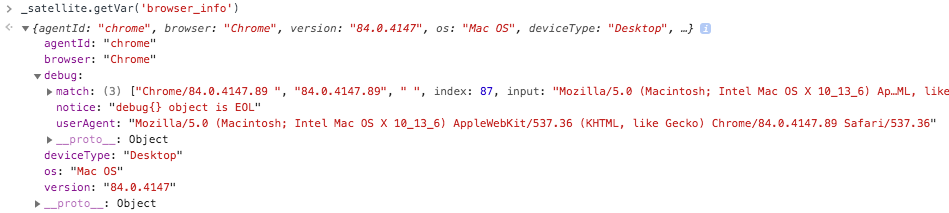

# detect-browser

This is a data element for Adobe Launch that attempts to detect a browser vendor and version using a navigator useragent in a browser. It is based on the [detect-browser package](https://github.com/DamonOehlman/detect-browser) by [Damian Oelman](https://github.com/DamonOehlman]

The goal is to provide an easy way to identify regular browser, in-app webview browsers, social media in-app webviews, and bots/crawlers.

## Installation

1. Login to Adobe Launch
2. Navigate to Data Elements
3. Create a new data element
4. Name it 'browser_info'
4. Set Extension to Core
5. Set Data Element Type to Custom Code
6. Leave other values as defaults
7. Paste the code into the Editor
8. Build the working library

---

## Example Usage

`_satellite.getVar('browser_info')`


Returns the following object:

```
{
  agentId: 'chrome', // key for regex match in userAgentRules
  browser: 'Chrome', // human readable label for the identified browser.
  version: '84.0.4147', //browser version,
  os: 'Mac OS',      Operating system matched,
  deviceType: 'Desktop'
}
```


### Note

When writing the regular expression remember that you would write it containing a
single [capturing group](https://regexone.com/lesson/capturing_groups) which
captures the version number of the browser.

## LICENSE

The MIT License (MIT)

Copyright (c) 2019 Damon Oehlman <damon.oehlman@gmail.com>

Permission is hereby granted, free of charge, to any person obtaining a copy
of this software and associated documentation files (the "Software"), to deal
in the Software without restriction, including without limitation the rights
to use, copy, modify, merge, publish, distribute, sublicense, and/or sell
copies of the Software, and to permit persons to whom the Software is
furnished to do so, subject to the following conditions:

The above copyright notice and this permission notice shall be included in all
copies or substantial portions of the Software.

THE SOFTWARE IS PROVIDED "AS IS", WITHOUT WARRANTY OF ANY KIND, EXPRESS OR
IMPLIED, INCLUDING BUT NOT LIMITED TO THE WARRANTIES OF MERCHANTABILITY,
FITNESS FOR A PARTICULAR PURPOSE AND NONINFRINGEMENT. IN NO EVENT SHALL THE
AUTHORS OR COPYRIGHT HOLDERS BE LIABLE FOR ANY CLAIM, DAMAGES OR OTHER
LIABILITY, WHETHER IN AN ACTION OF CONTRACT, TORT OR OTHERWISE, ARISING FROM,
OUT OF OR IN CONNECTION WITH THE SOFTWARE OR THE USE OR OTHER DEALINGS IN THE
SOFTWARE.
